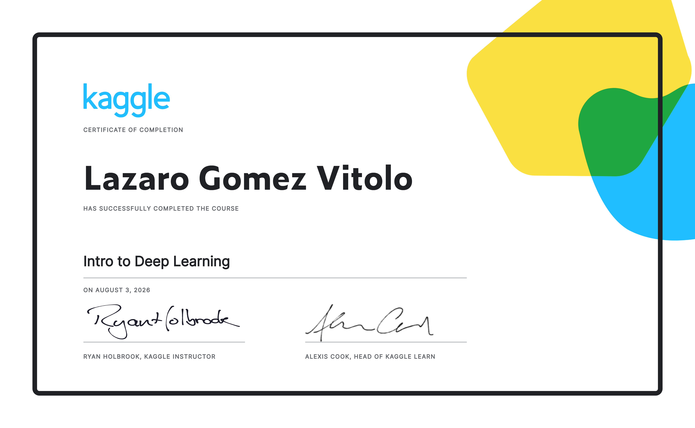
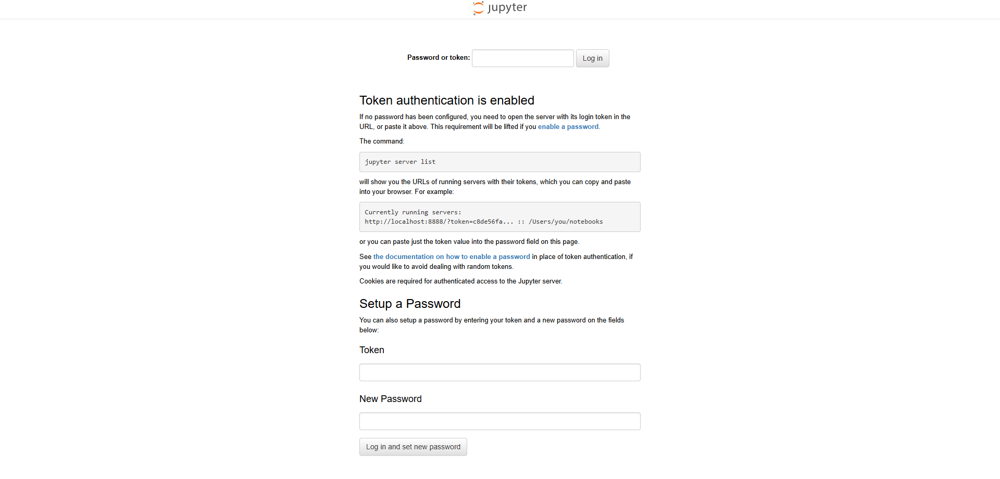

# Intro to Deep Learning — TensorFlow & Keras on Structured Data

[](https://github.com/Lazaro549/intro-deep-learning-starter/actions/workflows/ci.yml)




A hands-on companion to Kaggle Learn's **[Intro to Deep Learning](https://www.kaggle.com/learn/intro-to-deep-learning)**
course (instructor: Ryan Holbrook), rebuilding all six lessons with `tf.keras` on real structured/tabular data
instead of just reading along.

## What's here

[`notebooks/intro_to_deep_learning.ipynb`](notebooks/intro_to_deep_learning.ipynb) walks through the full course
syllabus end-to-end — fully executed, with outputs and plots already baked in so it renders directly on GitHub:

| # | Lesson | Demonstrates |
|---|---|---|
| 1 | A Single Neuron | `Dense(1)` as linear regression |
| 2 | Deep Neural Networks | Stacked `Dense` + `relu` layers |
| 3 | Stochastic Gradient Descent | Explicit optimizer / loss / batch size, loss curves |
| 4 | Overfitting and Underfitting | Watching a model overfit, then fixing it with `EarlyStopping` |
| 5 | Dropout and Batch Normalization | Regularizing an overparameterized network — with an honest look at when each technique actually helps |
| 6 | Binary Classification | `sigmoid` + `binary_crossentropy` + `binary_accuracy` |

Two structured datasets from scikit-learn power the notebook, both bundled with the library so nothing needs to be
downloaded:

- **Regression** — `load_diabetes` (442 patients, 10 baseline features, disease-progression target)
- **Binary classification** — `load_breast_cancer` (569 samples, 30 features, malignant/benign)

Lesson 5 is worth calling out: rather than assuming Dropout and BatchNormalization both help by default, the
notebook measures the train/validation gap for each and shows that BatchNorm's benefit is dataset-dependent — on
this small a dataset its mini-batch statistics stay noisy and it doesn't reliably help, while Dropout alone does.
That's the actual takeaway from the lesson, not just the API syntax.

## Getting started

```bash
git clone https://github.com/lazaro549/intro-deep-learning-starter.git
cd intro-deep-learning-starter
pip install -r requirements.txt
jupyter lab notebooks/intro_to_deep_learning.ipynb
```

If you'd rather use the classic Notebook interface: `jupyter notebook notebooks/intro_to_deep_learning.ipynb`
(needs the `notebook` package from requirements.txt — some environments don't pull it in just from
`pip install jupyter`).

Tested with Python 3.12.3, TensorFlow 2.21.0, Keras 3.15.1, scikit-learn 1.8.0, pandas 3.0.2.

## Repo structure

```text
.
├── .github/
│   └── workflows/
│       └── ci.yml
├── certificate/
│   └── kaggle-intro-to-deep-learning-certificate.png
├── evaluation/
│   ├── cross_validation.py
│   ├── held_out_test.py
│   ├── evaluation_report.md
│   └── results.json
├── notebooks/
│   └── intro_to_deep_learning.ipynb
├── tests/
│   ├── test_data_preprocessing.py
│   ├── test_model_architecture.py
│   └── test_evaluation_metrics.py
├── requirements.txt
├── LICENSE
└── .gitignore
```
## Evaluation & Testing

The project includes automated evaluation and testing:

- **5-fold cross-validation** for regression and classification.
- **Held-out test set** for final evaluation.
- **Unit tests** covering preprocessing, model architecture, and metrics.
- **Notebook smoke test** executed automatically in CI.
- **GitHub Actions CI** validates tests and notebook execution.

Run the tests locally:

    
    pytest -q
## Certificate

Kaggle "Intro to Deep Learning" — completed by Lazaro Gomez Vitolo, August 3, 2026. See
[`certificate/`](certificate/).

## 💸 Donations

If you'd like to support this project:

- 🇦🇷 ARS (Argentina)  
  Alias: `lazaro.503.alaba.mp`

- 🌎 USD (Argentina, local transfers only)  
  Alias: `ahogada.duras.foca`

## License

MIT — see [LICENSE](LICENSE).
